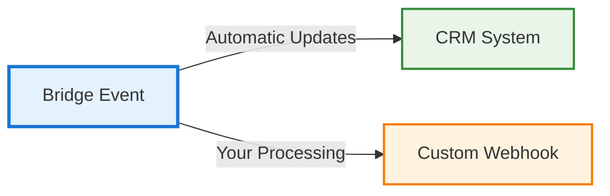

# Console Configuration

You can manage all webhook settings directly from the [Bridge Admin Console](https://admin.bridge.new).  
This includes defining your webhook endpoint, authentication keys, and selecting which event types to subscribe to.

---

## Setting Up Webhooks

Follow these steps to configure your webhook in the Bridge Admin Console:

1. **Log in** to your Bridge Admin Console.
2. Navigate to **Developers → Webhooks**.
3. Provide the following details:
   - **Webhook URL:** The full HTTPS URL of your endpoint.
   - **API Key:** Used for identifying your workspace.
   - **Client Secret:** Used to generate and verify webhook signatures (HMAC-SHA256).
4. **Select Event Types** you want to subscribe to.

---

## CRM Integration Behavior

When you have a CRM system connected to your Bridge workspace, **CRM updates happen automatically**:

### Automatic CRM Updates

- **CRM-connected features** are **automatically reported** to your CRM system
- Your CRM is **automatically updated** with new data without any additional configuration
- This happens in real-time as events occur in your Bridge workspace

### Custom Webhooks (Optional)

- **Custom webhooks** are **optional** and provide additional processing capabilities
- You can configure custom webhooks for the same events that are already being sent to your CRM
- This allows you to:
  - Send data to additional systems beyond your CRM
  - Apply custom business logic or transformations
  - Integrate with other third-party services

### Dual Data Flow

### Key Points

- **CRM updates are automatic** - no configuration needed
- **Custom webhooks are optional** - only configure if you need additional processing
- **Both can work together** - CRM gets updated automatically while custom webhooks provide additional flexibility
- **No duplication** - the same event can update your CRM and trigger your custom webhook

### CRM Provider Detection

The console automatically detects your connected CRM provider and shows which features are already being reported. You can:

- View which events are currently sent to your CRM automatically
- Configure additional webhook endpoints for the same events (optional)
- Customize event versions and processing logic for custom webhooks

---

## Event Subscription Options

Bridge currently supports the following event categories:

### Conversation Summaries (`v1`)

Receive notifications when conversation summaries are created, updated, or deleted.

- `conversation_summary.created`
- `conversation_summary.updated`
- `conversation_summary.deleted`

### Contact Updates (`v1`)

Receive notifications when contacts are created, updated, or deleted.

- `contact.created`
- `contact.updated`
- `contact.deleted`

---

## Verifying Your Configuration

Once you save your webhook configuration, Bridge automatically sends a **test webhook** to your endpoint to ensure it is reachable and correctly responding.

Your endpoint must respond with:

- **HTTP Status Code:** `200–299`
- **Content-Type:** `application/json` (optional)
- **Response Time:** under **30 seconds**

---

## Managing Webhooks

You can manage your webhook configuration anytime from the console:

| Action             | Description                                                         |
| ------------------ | ------------------------------------------------------------------- |
| **Edit**           | Update the URL, API key, or subscribed events                       |
| **Disable Events** | Temporarily pause specific event types without deleting the webhook |
| **Delete**         | Permanently remove a webhook configuration                          |

---

## Related Topics

- [Overview](./index)
- [Verifying Signatures](./verifying-signatures)
- [Event Types](./events)
