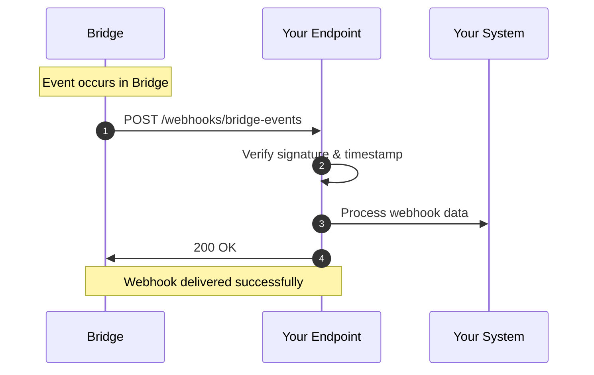

# Bridge Webhooks Overview

Bridge uses webhooks to notify your system when key events occur in your workspace.  
Each webhook contains authentication headers and a structured JSON payload sent via HTTPS `POST`.

---

## How Webhooks Work

1. An event occurs in Bridge (for example, a contact is updated or a conversation summary is created).
2. Bridge sends an HTTP `POST` request to your configured webhook endpoint.
3. Your server verifies the request signature and timestamp to confirm authenticity.
4. Your endpoint responds with a `2xx` HTTP status code to acknowledge receipt.



---

## HTTP Method

- **Method:** `POST`
- **Content-Type:** `application/json`

---

## Authentication Headers

Every webhook request sent from Bridge includes authentication headers to ensure secure delivery.

| Header               | Description                               | Purpose                              |
| -------------------- | ----------------------------------------- | ------------------------------------ |
| `X-Bridge-API-Key`   | Your custom API key                       | Basic client authentication          |
| `X-Bridge-Signature` | HMAC-SHA256 signature of the request body | Validates integrity and authenticity |
| `X-Bridge-Timestamp` | Unix timestamp of the request             | Protects against replay attacks      |

---

## Example Webhook Request

### HTTP Request

```http
POST /webhooks/bridge-events HTTP/1.1
Host: your-server.com
Content-Type: application/json
X-Bridge-API-Key: wh_1234567890abcdef
X-Bridge-Signature: sha256=a1b2c3d4e5f6789012345678901234567890abcdef
X-Bridge-Timestamp: 1735069432
```

### JSON Payload

```json
{
  "eventId": "evt_123456789",
  "eventType": "contact.updated",
  "entity": "contact_updates",
  "workspaceId": "ws_abc123",
  "timestamp": "2025-01-15T10:30:00Z",
  "payload": {
    "id": "contact_123",
    "firstName": "John",
    "lastName": "Doe",
    "email": "john@example.com"
  }
}
```

---

## Best Practices

- Always validate the HMAC signature before processing the payload.
- Reject requests where the timestamp (`X-Bridge-Timestamp`) is older than 5 minutes.
- Use HTTPS for all webhook endpoints.
- Return a `2xx` response within **30 seconds** to confirm successful delivery.

---

## Related Topics

- [Verifying Signatures](./verifying-signatures)
- [Event Types](./events)
- [Console Configuration](./configuration)
